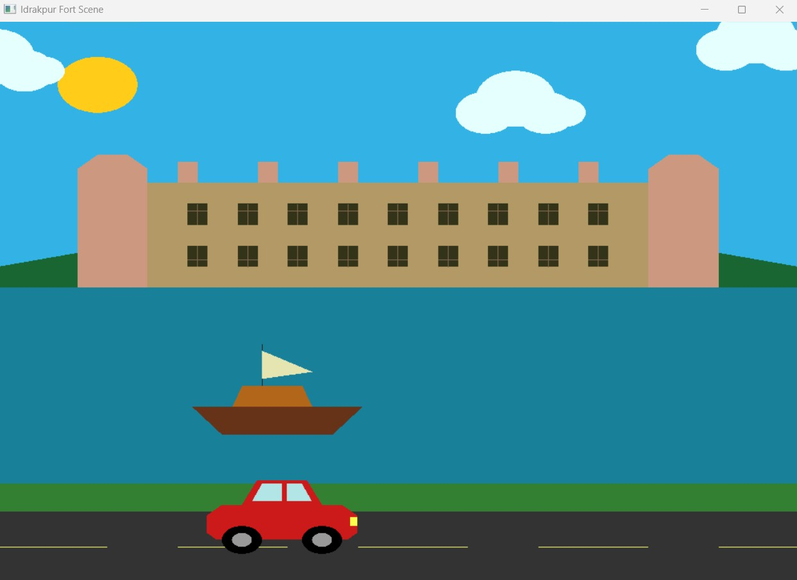
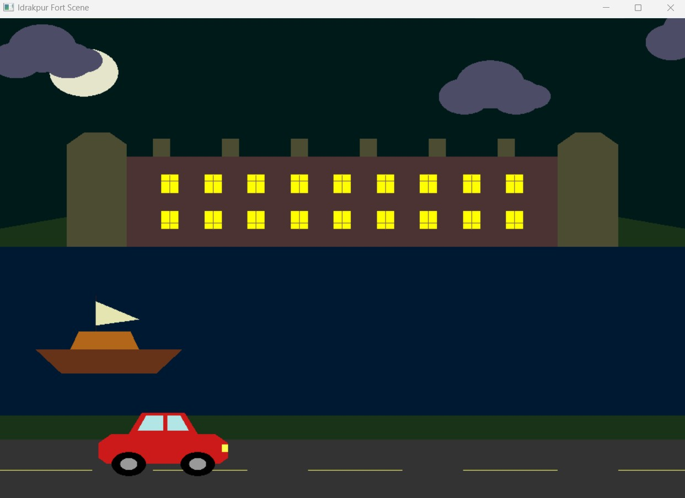
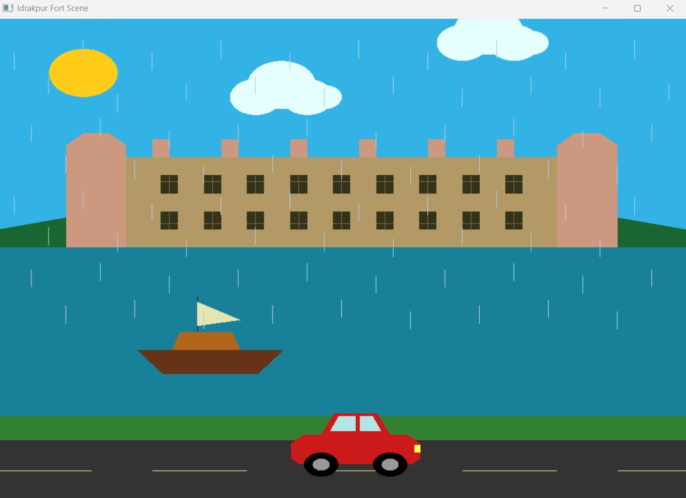

# 🏰 Idrakpur Fort — 2D Computer Graphics Project

A 2D graphical recreation of **Idrakpur Fort**, developed using **C++, OpenGL, and GLUT** as a Computer Graphics course project at American International University-Bangladesh (AIUB).

This project recreates the historical fort and its surrounding environment using 2D geometric shapes and OpenGL primitives. It features day/night mode, animated clouds, rain, a moving car, a moving boat, keyboard controls, and background sound.

## ✨ Features

* 🏰 **Fort Construction:** 2D modeling of Idrakpur Fort, including its body, battlements, and windows.
* ☀️ **Day Mode:** Bright sky, sun, and daytime colors.
* 🌙 **Night Mode:** Dark sky, moon, and nighttime colors.
* ☁️ **Cloud Animation:** Moving clouds with adjustable speed.
* 🌧️ **Rain Animation:** Toggle rain on or off.
* 🚗 **Car Animation:** Horizontally moving car with adjustable speed.
* 🚤 **Boat Animation:** Horizontally moving boat with adjustable speed.
* 🔊 **Background Sound:** Audio playback using Windows `PlaySound`.

## 🎮 Keyboard Controls

| Key               | Function                                             |
| ----------------- | ---------------------------------------------------- |
| `R`               | Turn rain ON/OFF                                     |
| `Right Arrow (→)` | Increase cloud speed                                 |
| `Left Arrow (←)`  | Decrease cloud speed; press twice to stop the clouds |
| `D`               | Switch to Day Mode                                   |
| `N`               | Switch to Night Mode                                 |
| `Up Arrow (↑)`    | Increase car and boat speed                          |
| `Down Arrow (↓)`  | Decrease car and boat speed                          |

## 🖼️ Project Screenshots

The following screenshots show the project in different modes.

### ☀️ Main Scene — Day Mode



### 🌙 Night Mode



### 🌧️ Rain Animation



## 🛠️ Technologies Used

| Component               | Technology          |
| ----------------------- | ------------------- |
| Programming Language    | C++                 |
| Graphics Library        | OpenGL              |
| Utility Toolkit         | GLUT / FreeGLUT     |
| Development Environment | Code::Blocks        |
| Operating System        | Windows             |
| Audio                   | Windows `PlaySound` |

## 🏗️ Project Overview

The objective of this project is to combine computer graphics with Bangladesh's historical heritage by digitally visualizing Idrakpur Fort.

The scene is constructed using OpenGL primitives, including polygons, quadrilaterals, lines, and circles. Animated objects and environmental changes make the scene more dynamic than a static drawing.

### Core Computer Graphics Concepts

* 2D coordinate systems
* Geometric modeling
* OpenGL primitive rendering
* Object translation and movement
* Animation and timer functions
* Keyboard input handling
* Color manipulation
* Scene composition

## ⚙️ Installation and Setup

### Prerequisites

* Windows operating system
* C++ compiler
* OpenGL libraries
* GLUT or FreeGLUT
* Code::Blocks or another compatible C++ IDE

### 1. Clone the Repository

```bash
git clone https://github.com/Asfaq5459/OpenGL-Idrakpur-Fort-.git
cd OpenGL-Idrakpur-Fort-
```

### 2. Configure OpenGL and GLUT

Install and configure the required C++ compiler, OpenGL, and GLUT/FreeGLUT libraries in your development environment.

### 3. Open the Project

Open `Port_Project.cbp` in Code::Blocks, or configure `main.cpp` in a compatible IDE.

### 4. Build and Run

Build the project after configuring the required libraries, then run the application.

**Audio note:** The application uses Windows `PlaySound`. Keep `a.wav` in the location expected by the source code.

## 📁 Project Structure

```text
OpenGL_Project/
├── main.cpp
├── Port_Project.cbp
├── README.md
├── Screenshots/
│   ├── day.jpg
│   ├── night.jpg
│   └── rain.jpg
└── bin/
    └── Debug/
        └── a.wav
```

## 🇧🇩 Cultural Significance

This project presents Bangladesh's historical heritage through a 2D graphical environment. It demonstrates how computer graphics can support cultural heritage visualization, educational demonstrations, and architectural representation.

## 👥 Project Authors

This project was developed as part of the Computer Graphics course at **American International University-Bangladesh (AIUB)**.

| Student ID   | Name                |
| ------------ | ------------------- |
| `23-54102-3` | **Asfaq Ahmed**     |
| `23-55721-3` | **Adib Afsar Khan** |

## 📚 Learning Outcomes

Through this project, we gained practical experience with 2D object modeling, OpenGL primitives, coordinate-based drawing, animation, keyboard controls, object movement, and graphical scene composition.

## 📄 Conclusion

The **Idrakpur Fort 2D Computer Graphics Project** demonstrates how C++, OpenGL, and GLUT can be used to recreate a historical structure through geometric modeling and animation. With day/night mode, animated clouds and rain, a moving car and boat, keyboard controls, and background sound, the project combines fundamental computer graphics concepts with the cultural heritage of Bangladesh.

## 📜 License

This project was developed for educational purposes as part of the Computer Graphics course at American International University-Bangladesh (AIUB).
